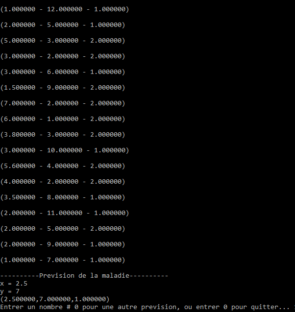

# K-Nearest-Neighbours
## C - Language

### Copy the files "file.txt" which contains data and "main.c" to one folder.
### open cmd
### cd name of this folder 
### To compile write the command : gcc main.c -o prog
### To execute write : prog

## Execution :

